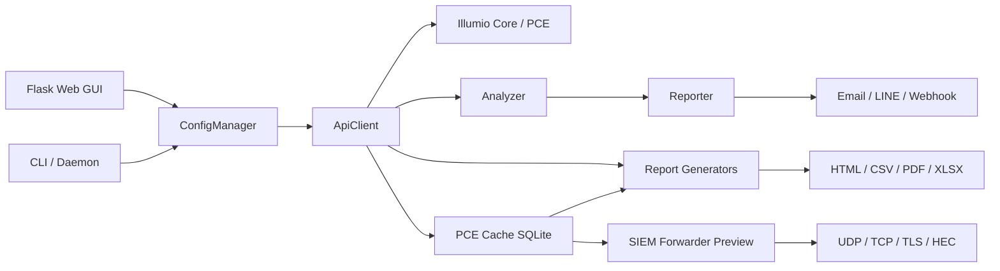

# Illumio PCE Ops — 架構與功能盤點

本文件是工程面的 canonical 文件：說明目前 repo 的功能邊界、資料流、主要模組與文件收斂決策。

## 1. 文件收斂決策

原本 `docs/` 同時存在中英重複文件與多個專題片段，維護成本高且容易過期。本次收斂後的主文件：

| 文件 | 定位 |
|:---|:---|
| `README_zh.md` | 快速入口與功能總覽 |
| `docs/User_Manual_zh.md` | 操作手冊，含部署、Web GUI、報表、PCE Cache、SIEM Preview |
| `docs/Project_Architecture_zh.md` | 架構、功能盤點、資料流、修改指南 |
| `docs/API_Cookbook_zh.md` | PCE API 與工具內部 API 整合 |
| `docs/Security_Rules_Reference_zh.md` | 安全規則、threshold、連接埠 |
| `docs/SIEM_Integration.md` | 既有英文 SIEM integration 相容文件，保留給測試與外部引用 |

已移除或合併：英文長篇重複文件、`PCE_Cache.md`、`SIEM_Forwarder.md`、`report_module_inventory_zh.md`。

## 2. 功能盤點

| 功能群 | 程式入口 | 功能 |
|:---|:---|:---|
| Entrypoint | `illumio_ops.py` | 判斷 Click 子命令或 legacy argparse 旗標，保持相容 |
| Click CLI | `src/cli/` | `monitor`、`gui`、`report`、`rule`、`workload`、`config`、`cache`、`siem`、`status`、`version` |
| Legacy CLI | `src/main.py` | 互動式選單、daemon loop、monitor-gui orchestration、legacy report dispatch |
| Web GUI | `src/gui/__init__.py` | Flask app factory、auth、CSRF、settings、rules、reports、dashboard、quarantine、rule scheduler、logs、daemon restart |
| PCE API | `src/api_client.py` | PCE REST calls、async traffic query、label cache、retry/resume、raw Explorer CSV export |
| Config | `src/config.py`、`src/config_models.py` | JSON config load/save、Pydantic schema、PCE profile、best practice rules |
| Event pipeline | `src/events/` | Event catalog、normalizer、matcher、poller、shadow compare、throttle、stats |
| Monitor engine | `src/analyzer.py` | 事件與流量規則評估、狀態保存、告警觸發 |
| Alerts | `src/reporter.py`、`src/alerts/` | Email、LINE、Webhook、plugin metadata |
| Scheduler | `src/scheduler/`、`src/report_scheduler.py`、`src/rule_scheduler.py` | APScheduler jobs、報表排程、PCE rule 啟停排程 |
| Reports | `src/report/` | Traffic、Audit、VEN Status、Policy Usage；HTML/CSV/PDF/XLSX exporters |
| PCE Cache | `src/pce_cache/`、`src/pce_cache_cli.py`、`src/pce_cache/web.py` | SQLite schema、ingestor、aggregator、reader、backfill、retention、watermark、lag monitor |
| SIEM Preview | `src/siem/`、`src/siem_cli.py`、`src/siem/web.py` | Destinations、transports、formatters、dispatcher、DLQ、test event |
| i18n | `src/i18n.py`、`src/i18n_en.json`、`src/i18n_zh_TW.json` | CLI/Web/report/alert 字串集中管理 |

## 3. 系統架構

### 3.1 設計原則

- CLI 與 Web GUI 共用 ConfigManager 與核心 service，而不是各自維護設定。
- PCE API 查詢集中在 `ApiClient`，報表與監控不直接組 endpoint。
- 報表 pipeline 使用 DataFrame 作為中間格式，輸出由 exporter 負責。
- Cache 是效能與韌性層，不是唯一真相；coverage 不足時回 API。
- SIEM Preview 以 cache dispatch row 與 DLQ 管理重送，不阻塞監控主流程。

## 4. 主要資料流

### 4.1 監控告警

1. Daemon 或 GUI persistent mode 啟動 monitor cycle。
2. `Analyzer` 查 PCE events / traffic，或從 cache subscriber 讀取。
3. Event matcher / traffic rule engine 評估規則。
4. 符合 threshold 且未被 cooldown/throttle 擋下時送出 alert。
5. `Reporter` 分派到 Email、LINE、Webhook。
6. State 寫入 logs/state file，避免重複告警。

### 4.2 Traffic Report

1. GUI/CLI 指定 API、CSV 或 cache-aware path。
2. `ReportGenerator` 解析資料並執行 validator/coerce。
3. `RulesEngine` 產生 B/L/R findings。
4. `src.report.analysis` registry 執行 mod01-mod15 與 R3 模組。
5. `mod12` executive summary 最後整合 KPI、findings、attack posture。
6. Exporters 輸出 HTML/CSV/PDF/XLSX 與 metadata。
7. Snapshot 與 trend data 寫入供 dashboard / Change Impact 使用。

### 4.3 PCE Cache

1. Events/traffic ingestor 依 poll interval 抓 PCE 資料。
2. Raw traffic 與 events 寫入 SQLite。
3. Aggregator 產生彙總資料。
4. Retention worker 清理過期 raw/agg/events。
5. Report reader 判斷 full/partial/miss coverage。

### 4.4 SIEM Preview

1. Runtime 從 cache tables enqueue dispatch rows。
2. Dispatcher 依 destination 設定格式化 payload。
3. Transport 發送 UDP/TCP/TLS/HEC。
4. 失敗超過 retry 或 payload 無效時進 DLQ。
5. CLI/Web 可 list/replay/purge/export DLQ。

## 5. 報表模組盤點

### 5.1 Traffic Report

| 模組 | 用途 |
|:---|:---|
| `mod01` Traffic Overview | 流量總覽、policy coverage、top ports/protocols |
| `mod02` Policy Decisions | allowed/blocked/potentially_blocked 分布與明細 |
| `mod03` Uncovered Flows | 未覆蓋流量、port gap、service gap |
| `mod04` Ransomware Exposure | 勒索軟體風險連接埠暴露 |
| `mod06` User & Process | 使用者與 process 維度 |
| `mod07` Cross-Label Matrix | App/Env/Role/Loc label 之間的流量矩陣 |
| `mod08` Unmanaged Hosts | 未受管來源與目的地 |
| `mod09` Traffic Distribution | 流量分布 |
| `mod10` Allowed Traffic | 已允許流量摘要 |
| `mod11` Bandwidth | bytes / Mbps 相關分析 |
| `mod12` Executive Summary | KPI、findings、attack posture 摘要 |
| `mod13` Enforcement Readiness | 強制執行準備度 |
| `mod14` Infrastructure Scoring | 基礎設施關鍵性與圖分析 |
| `mod15` Lateral Movement | 橫向移動與 blast radius |
| `mod_draft_summary` | draft policy decision subtype 摘要 |
| `mod_draft_actions` | override deny / boundary remediation |
| `mod_enforcement_rollout` | app enforcement rollout 排序 |
| `mod_ringfence` | app ringfence dependency profile |
| `mod_exfiltration_intel` | managed-to-unmanaged exfil 與 threat intel join |
| `mod_change_impact` | HTML export 時讀 snapshot 做 KPI 差異比較 |

`mod05` 已併入 `mod15`。

### 5.2 Audit Report

- Executive summary。
- System health。
- User activity。
- Policy changes。
- Event correlation。
- Risk classifier。

### 5.3 Policy Usage Report

- Executive summary。
- Overview / hit rate。
- Hit detail。
- Unused detail。
- Deny effectiveness。

### 5.4 VEN Status Report

- Agent health。
- Policy sync。
- Enforcement mode。
- Offline/visibility-only/selective/full 分布。

## 6. 修改指南

### 6.1 新增 UI / CLI / 報表文字

1. 先新增 i18n key。
2. 同步更新 `src/i18n_en.json` 與 `src/i18n_zh_TW.json`。
3. 使用 `t("key")` 或既有 report i18n helper。
4. 跑 i18n audit 與 i18n tests。

### 6.2 新增 Traffic Report 模組

1. 在 `src/report/analysis/` 新增模組。
2. 在 `src/report/analysis/__init__.py` 註冊 module id、module path、function、adapter。
3. 在 HTML exporter 加章節 render。
4. 在 `src/report/section_guidance.py` 加 guidance。
5. 增加 i18n key 與測試。

### 6.3 新增 Web GUI API

1. 優先放入適合的 Blueprint。
2. 需要登入的 endpoint 加 `@login_required`。
3. 非 GET 修改操作要符合 CSRF contract。
4. JSON error 文字使用 i18n key。
5. 補 GUI security/API tests。

### 6.4 新增 config 欄位

1. 更新 `_DEFAULT_CONFIG`。
2. 更新 `ConfigSchema` / 對應 Pydantic model。
3. 更新 `config/config.json.example`。
4. 補 validation 與 backwards compatibility tests。
